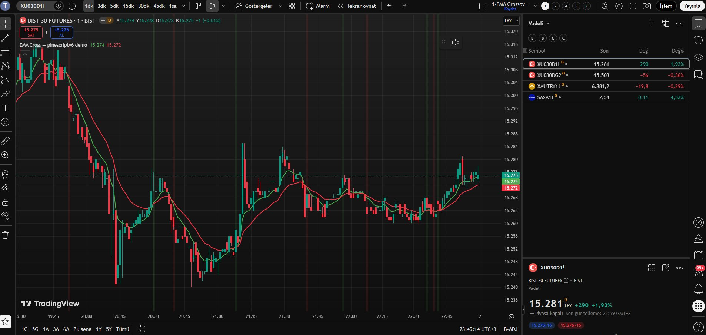

# Pine Script v6 Reference

<div align="center">


**TradingView Pine Script v6 — AI destekli geliştirme ortamı**
**TradingView Pine Script v6 — AI-assisted development reference**

Tasarım ve geliştirme / Designed & built by [Ugur Pala](https://github.com/trugurpala) · mail@ugurpala.com

</div>

---

## 📺 Demo

> **XU030 (BIST 30 Futures) — EMA Cross Indicator**
> Aşağıdaki kod bu repodaki referans dosyaları kullanılarak Claude ile yazıldı.
> The code below was written by Claude using the reference files in this repo.



```pine
//@version=6
indicator("EMA Cross — pinescriptv6 demo", overlay=true)
fast = ta.ema(close, 9)
slow = ta.ema(close, 21)
plot(fast, "EMA 9",  color.green, 2)
plot(slow, "EMA 21", color.red,   2)
bgcolor(ta.crossover(fast, slow)  ? color.new(color.green, 90) :
        ta.crossunder(fast, slow) ? color.new(color.red,   90) : na)
```

---

## ⚙️ LESSONS_LEARNED Sistemi / System


---

## TR | Türkçe

### Bu Repo Nedir?

Bu repo; TradingView'ın resmi Pine Script v6 dokümantasyonunu temel kaynak alarak,
**yapay zeka destekli geliştirme için baştan tasarlanmış** özgün bir bilgi tabanıdır.

Tüm içerik, sistem tasarımı ve yapı **Uğur Pala** tarafından oluşturulmuştur.

Bu repoya özgü özellikler:

| Özellik | Ne İşe Yarar? |
|---------|--------------|
| **LESSONS_LEARNED.md** | AI her hata çözümünde buraya yazar. Bir dahaki oturumda önce bunu okur, aynı hatayı bir daha yapmaz. |
| **LLM_MANIFEST.md** | Hangi soruda hangi dosyanın okunacağını belirleyen yönlendirme haritası. Tüm repoyu yüklemek yerine sadece ilgili dosyayı çeker. |
| **SKILL.md** | AI'ın bu repodaki yazma protokolü. |
| **Entegrasyon** | Claude / Cursor / Windsurf / Copilot — kutu açılır açılmaz hazır. |

> **Kaynak notu:** Temel referans materyali olarak TradingView'ın resmi Pine Script v6
> dokümantasyonundan yararlanılmıştır. TradingView bu projeyle hiçbir bağlantısı veya
> onayı bulunmamaktadır.

### Hızlı Başlangıç

```bash
git clone https://github.com/trugurpala/pinescriptv6.git
```

### Claude Projects ile Kullanım

1. [Claude.ai](https://claude.ai) → Projects → Projeniz
2. Files → **+** → GitHub → Yapıştır:
   `https://github.com/trugurpala/pinescriptv6`
3. Tüm dosyaları seç → **Add files**
4. Sohbette `/pinescript-v6` yazarak skill'i aktifleştir

### Cursor / Windsurf / Copilot ile Kullanım

Repoyu klonlayın — `.cursorrules` ve `.github/copilot-instructions.md` otomatik devreye girer.

| Görev | Dosya |
|-------|-------|
| İndikatör yazıyorum | `@reference/functions/ta.md` + `@reference/functions/drawing.md` |
| Strateji yazıyorum | `@reference/functions/strategy.md` |
| Çoklu zaman dilimi | `@reference/functions/request.md` |
| Hata alıyorum | `@concepts/common_errors.md` |
| **Her şeyden önce** | `@LESSONS_LEARNED.md` |

### Lisans

MIT — detaylar için [LICENSE](LICENSE) dosyasına bakın.
Telif Hakkı © 2025 [Uğur Pala](https://github.com/trugurpala) · mail@ugurpala.com

---

## EN | English

### What is this?

This repository takes the official TradingView Pine Script v6 documentation as its
primary source and builds an original, purpose-built knowledge base for AI-assisted development.

All content, system design, and structure were created by **Ugur Pala**.

| Feature | What it does |
|---------|-------------|
| **LESSONS_LEARNED.md** | The AI appends every solved error here. Next session it reads this first — same mistake never happens twice. |
| **LLM_MANIFEST.md** | Routing map that tells the AI which file to read for which query, instead of loading the entire repo. |
| **SKILL.md** | The AI's writing protocol for this codebase. |
| **Integrations** | Claude / Cursor / Windsurf / Copilot — works out of the box. |

> **Source note:** The official TradingView Pine Script v6 documentation was used as the
> primary reference material. TradingView is not affiliated with or endorsing this project.

### Quick Start

```bash
git clone https://github.com/trugurpala/pinescriptv6.git
```

### Use with Claude Projects

1. [Claude.ai](https://claude.ai) → Projects → your project
2. Files → **+** → GitHub → paste:
   `https://github.com/trugurpala/pinescriptv6`
3. Select all files → **Add files**
4. Type `/pinescript-v6` in chat to activate the skill

### Use with Cursor / Windsurf / Copilot

Clone the repo — `.cursorrules` and `.github/copilot-instructions.md` are picked up automatically.

| Task | File |
|------|------|
| Writing an indicator | `@reference/functions/ta.md` + `@reference/functions/drawing.md` |
| Writing a strategy | `@reference/functions/strategy.md` |
| Multi-timeframe data | `@reference/functions/request.md` |
| Fixing an error | `@concepts/common_errors.md` |
| **Before anything** | `@LESSONS_LEARNED.md` |

### Use with Custom GPTs or Other LLMs

1. Download this repo as a ZIP
2. Upload to your Custom GPT Knowledge or RAG pipeline
3. Recommended minimum: `LLM_MANIFEST.md` + `LESSONS_LEARNED.md` + `reference/functions/`

### File Structure

```
pinescriptv6/
├── LESSONS_LEARNED.md          TR: Hata hafızası   / EN: Auto-updated error log
├── SKILL.md                    TR: AI yazma prot.  / EN: AI writing protocol
├── LLM_MANIFEST.md             TR: Sorgu yönl.     / EN: Query routing map
├── docs/
│   ├── demo_chart.png          ← XU030 demo screenshot
│   └── lessons_flow.png        ← System flow diagram
├── concepts/
│   ├── execution_model.md
│   ├── common_errors.md
│   ├── timeframes.md
│   ├── colors_and_display.md
│   ├── methods.md
│   └── objects.md
├── reference/
│   ├── variables.md
│   ├── constants.md
│   ├── types.md
│   ├── keywords.md
│   ├── annotations.md
│   └── functions/
│       ├── ta.md
│       ├── strategy.md
│       ├── drawing.md
│       ├── request.md
│       ├── collections.md
│       └── general.md
└── writing_scripts/
    ├── style_guide.md
    ├── debugging.md
    ├── profiling_and_optimization.md
    └── limitations.md
```

### License

MIT — see [LICENSE](LICENSE) for details.
Copyright © 2025 [Ugur Pala](https://github.com/trugurpala) · mail@ugurpala.com

---

<div align="center">

⭐ **If this repo saved you time, please give it a star!** ⭐
Bu repo işinize yaradıysa lütfen yıldız verin!

[](https://star-history.com/#trugurpala/pinescriptv6&Date)

</div>
