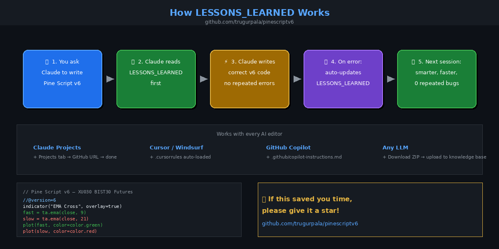

# Pine Script v6 Reference

<div align="center">


**TradingView Pine Script v6 için AI destekli, hata hafızalı geliştirme ortamı.**
**AI-powered Pine Script v6 development environment with error memory.**

[Ugur Pala](https://github.com/trugurpala) · mail@ugurpala.com

[Hızlı Başlangıç](#-hızlı-başlangıç--quick-start) ·
[Claude Projects](#-claude-projects) ·
[Cursor](#%EF%B8%8F-cursor) ·
[Windsurf](#-windsurf) ·
[Copilot](#-github-copilot) ·
[Örnekler / Examples](#-örnekler--examples) ·
[Dosya Yapısı](#-dosya-yapısı--file-structure)

</div>

---

## 📺 Demo — XU030 (BIST 30 Futures)

> TR: Aşağıdaki indikatör, bu repodaki referanslar kullanılarak Claude ile yazıldı.
> EN: The indicator below was written by Claude using the reference files in this repo.


```pine
//@version=6
indicator("EMA Cross", overlay=true)
fast = ta.ema(close, 9)
slow = ta.ema(close, 21)
plot(fast, "EMA 9",  color.green, 2)
plot(slow, "EMA 21", color.red,   2)
bgcolor(ta.crossover(fast, slow)  ? color.new(color.green, 90) :
        ta.crossunder(fast, slow) ? color.new(color.red,   90) : na)
```

---

## ⚙️ Nasıl Çalışır / How It Works



| Adım / Step | TR | EN |
|---|---|---|
| 1 | Kodu yazmadan önce `LESSONS_LEARNED.md` okunur | Read `LESSONS_LEARNED.md` before writing |
| 2 | `LLM_MANIFEST.md` ile doğru referans dosyası bulunur | Find the right file via `LLM_MANIFEST.md` |
| 3 | Temiz, v6 uyumlu kod yazılır | Write clean, v6-compliant code |
| 4 | Hata oluşursa çözülür ve **otomatik kaydedilir** | On error: solved and **auto-saved** |
| 5 | Sonraki oturumda aynı hata bir daha yapılmaz | Same mistake never repeated next session |

---

## 🚀 Hızlı Başlangıç / Quick Start

```bash
git clone https://github.com/trugurpala/pinescriptv6.git
```

---

## 🤖 Claude Projects

> TR: Claude.ai Projects ile entegrasyon — en tam deneyim için önerilen yöntem.
> EN: Integration with Claude.ai Projects — recommended for the fullest experience.

### TR | Türkçe — Adım Adım

**1. Projeyi aç**

[claude.ai/projects](https://claude.ai/projects) adresine git → mevcut projenizi açın ya da **+ New project** ile yeni oluşturun.

**2. GitHub reposunu bağla**

Sağ panelde **Files** → **+** → **GitHub** seçin.

Açılan pencerede URL kutusuna yapıştırın:

```
https://github.com/trugurpala/pinescriptv6
```

**3. Tüm dosyaları seç**

En üstteki **pinescriptv6** checkbox'ına tıklayın → tüm dosyalar seçilir → **Add files** butonuna basın.

**4. Skill'i aktifleştir**

Proje sohbetinde şunu yazın:

```
/pinescript-v6
```

Artık Claude her Pine Script v6 kodu yazmadan önce otomatik olarak `LESSONS_LEARNED.md` ve `LLM_MANIFEST.md` dosyalarını okur.

---

### EN | English — Step by Step

**1. Open your project**

Go to [claude.ai/projects](https://claude.ai/projects) → open an existing project or click **+ New project**.

**2. Connect the GitHub repo**

In the right panel: **Files** → **+** → **GitHub**.

In the dialog, paste the URL:

```
https://github.com/trugurpala/pinescriptv6
```

**3. Select all files**

Click the top-level **pinescriptv6** checkbox → all files are selected → click **Add files**.

**4. Activate the skill**

In the project chat, type:

```
/pinescript-v6
```

Claude will now automatically read `LESSONS_LEARNED.md` and `LLM_MANIFEST.md` before writing any Pine Script v6 code.

---

## ⌨️ Cursor

> TR: Cursor v0.44+ için `.cursor/rules/pinescriptv6.mdc`, eski sürümler için `.cursorrules` otomatik yüklenir.
> EN: `.cursor/rules/pinescriptv6.mdc` loads for Cursor v0.44+, `.cursorrules` for older versions.

### TR | Türkçe

**1. Repoyu klonla**

```bash
git clone https://github.com/trugurpala/pinescriptv6.git
cd pinescriptv6
```

**2. Cursor ile aç**

```bash
cursor .
```

Kurallar otomatik devreye girer. Cursor'ın Pine Script v6 yazarken `LESSONS_LEARNED.md` dosyasını her seferinde okuduğunu göreceksiniz.

**3. Sohbette kullan — referans dosyalarını tag'le**

Cursor Chat veya Composer'da:

```
@LESSONS_LEARNED.md EMA cross stratejisi yaz, XU030 için
```

```
@reference/functions/ta.md RSI divergence indikatörü yaz
```

```
@concepts/common_errors.md Bu hatanın sebebi ne?
```

**4. Tüm repoyu bağlam olarak ekle**

Cursor'da `Ctrl+Shift+P` → **Add to context** → klasörü seç.

---

### EN | English

**1. Clone the repo**

```bash
git clone https://github.com/trugurpala/pinescriptv6.git
cd pinescriptv6
```

**2. Open with Cursor**

```bash
cursor .
```

Rules load automatically. Cursor will read `LESSONS_LEARNED.md` before every Pine Script v6 session.

**3. Use in chat — tag reference files**

In Cursor Chat or Composer:

```
@LESSONS_LEARNED.md write an EMA cross strategy for XU030
```

```
@reference/functions/ta.md write an RSI divergence indicator
```

```
@concepts/common_errors.md what causes this error?
```

**4. Add the whole repo as context**

`Ctrl+Shift+P` → **Add to context** → select the folder.

---

## 🌊 Windsurf

> TR: `.windsurfrules` dosyası Windsurf tarafından otomatik okunur.
> EN: `.windsurfrules` is picked up automatically by Windsurf.

### TR | Türkçe

**1. Repoyu klonla**

```bash
git clone https://github.com/trugurpala/pinescriptv6.git
cd pinescriptv6
```

**2. Windsurf ile aç**

```bash
windsurf .
```

`.windsurfrules` otomatik yüklenir — Cascade asistanı artık Pine Script v6 kurallarını biliyor.

**3. Cascade'de kullan**

```
@LESSONS_LEARNED.md Supertrend stratejisi yaz
```

```
@reference/functions/strategy.md ATR tabanlı SL/TP nasıl yazılır?
```

---

### EN | English

**1. Clone the repo**

```bash
git clone https://github.com/trugurpala/pinescriptv6.git
cd pinescriptv6
```

**2. Open with Windsurf**

```bash
windsurf .
```

`.windsurfrules` loads automatically — Cascade now knows Pine Script v6 rules.

**3. Use in Cascade**

```
@LESSONS_LEARNED.md write a Supertrend strategy
```

```
@reference/functions/strategy.md how to write ATR-based SL/TP?
```

---

## 🐙 GitHub Copilot

> TR: `.github/copilot-instructions.md` VS Code, JetBrains ve diğer Copilot destekli editörlerde otomatik devreye girer.
> EN: `.github/copilot-instructions.md` activates automatically in VS Code, JetBrains, and any Copilot-enabled editor.

### TR | Türkçe

**1. Repoyu klonla**

```bash
git clone https://github.com/trugurpala/pinescriptv6.git
```

**2. VS Code ile aç**

```bash
code pinescriptv6
```

GitHub Copilot Chat, `.github/copilot-instructions.md` dosyasını otomatik okur.

**3. Copilot Chat'te kullan**

```
/pinescript-v6 yaz: Bollinger Band squeeze stratejisi
```

```
Bu Pine Script v6 hatasını açıkla ve düzelt
```

**4. Önerilen chat prompt'ları:**

```
LESSONS_LEARNED.md dosyasını kontrol et, sonra bir RSI mean reversion stratejisi yaz.
```

```
reference/functions/ta.md dosyasına göre ta.pivothigh() imzası nedir?
```

---

### EN | English

**1. Clone the repo**

```bash
git clone https://github.com/trugurpala/pinescriptv6.git
```

**2. Open with VS Code**

```bash
code pinescriptv6
```

GitHub Copilot Chat reads `.github/copilot-instructions.md` automatically.

**3. Use in Copilot Chat**

```
/pinescript-v6 write: Bollinger Band squeeze strategy
```

```
Explain and fix this Pine Script v6 error
```

**4. Recommended chat prompts:**

```
Check LESSONS_LEARNED.md, then write an RSI mean reversion strategy.
```

```
According to reference/functions/ta.md, what is the ta.pivothigh() signature?
```

---

## 🤗 Custom GPT / Diğer LLM'ler / Other LLMs

### TR | Türkçe

**1. Repoyu ZIP olarak indir**

[https://github.com/trugurpala/pinescriptv6/archive/refs/heads/main.zip](https://github.com/trugurpala/pinescriptv6/archive/refs/heads/main.zip)

**2. ZIP'i aç ve dosyaları yükle**

Custom GPT Knowledge'a veya tercih ettiğiniz RAG sistemine yükleyin.

**Minimum önerilen yükleme:**
- `LESSONS_LEARNED.md`
- `LLM_MANIFEST.md`
- `reference/functions/ta.md`
- `reference/functions/strategy.md`
- `reference/functions/drawing.md`
- `concepts/common_errors.md`

**3. Sistem promptuna ekle**

```
Bu proje Pine Script v6 geliştirme için optimize edilmiş bir bilgi tabanıdır.
Kod yazmadan önce her zaman LESSONS_LEARNED.md içeriğini kontrol et.
Hangi dosyayı okuyacağını belirlemek için LLM_MANIFEST.md'ye başvur.
Tüm scriptler //@version=6 ile başlamalıdır.
```

---

### EN | English

**1. Download repo as ZIP**

[https://github.com/trugurpala/pinescriptv6/archive/refs/heads/main.zip](https://github.com/trugurpala/pinescriptv6/archive/refs/heads/main.zip)

**2. Extract and upload files**

Upload to your Custom GPT Knowledge or preferred RAG system.

**Recommended minimum upload:**
- `LESSONS_LEARNED.md`
- `LLM_MANIFEST.md`
- `reference/functions/ta.md`
- `reference/functions/strategy.md`
- `reference/functions/drawing.md`
- `concepts/common_errors.md`

**3. Add to system prompt**

```
This project is a knowledge base optimised for Pine Script v6 development.
Always check LESSONS_LEARNED.md before writing any code.
Consult LLM_MANIFEST.md to determine which file to read for each task.
All scripts must start with //@version=6.
```

---

## 📦 Örnekler / Examples

TR: 22 hazır Pine Script v6 örneği — copy-paste hazır, test edilmiş.
EN: 22 ready-to-use Pine Script v6 examples — copy-paste ready, tested.

### İndikatörler / Indicators

| # | Dosya | Açıklama / Description |
|---|-------|------------------------|
| 01 | [`examples/indicators/01_ema_cross.pine`](examples/indicators/01_ema_cross.pine) | EMA 9/21 Cross + bgcolor + alerts |
| 02 | [`examples/indicators/02_rsi_ob_os.pine`](examples/indicators/02_rsi_ob_os.pine) | RSI 14 Gradient — OB/OS zones |
| 03 | [`examples/indicators/03_macd_histogram.pine`](examples/indicators/03_macd_histogram.pine) | MACD 12/26/9 — colored histogram |
| 04 | [`examples/indicators/04_bollinger_bands.pine`](examples/indicators/04_bollinger_bands.pine) | Bollinger Bands + squeeze |
| 05 | [`examples/indicators/05_supertrend.pine`](examples/indicators/05_supertrend.pine) | Supertrend ATR-based |
| 06 | [`examples/indicators/06_vwap_session.pine`](examples/indicators/06_vwap_session.pine) | VWAP + StDev bands |
| 07 | [`examples/indicators/07_atr_levels.pine`](examples/indicators/07_atr_levels.pine) | ATR dynamic S/R levels |
| 08 | [`examples/indicators/08_pivot_points.pine`](examples/indicators/08_pivot_points.pine) | Classic Pivot Points (Daily) |
| 09 | [`examples/indicators/09_volume_profile.pine`](examples/indicators/09_volume_profile.pine) | Volume analysis + OBV |
| 10 | [`examples/indicators/10_stoch_rsi.pine`](examples/indicators/10_stoch_rsi.pine) | Stochastic RSI K/D |
| 11 | [`examples/indicators/11_ichimoku.pine`](examples/indicators/11_ichimoku.pine) | Ichimoku Cloud — all components |
| 12 | [`examples/indicators/12_mtf_ema.pine`](examples/indicators/12_mtf_ema.pine) | Multi-Timeframe EMA D/W/M |

### Stratejiler / Strategies

| # | Dosya | Açıklama / Description |
|---|-------|------------------------|
| 01 | [`examples/strategies/01_ema_cross_strategy.pine`](examples/strategies/01_ema_cross_strategy.pine) | EMA Cross — ATR SL/TP |
| 02 | [`examples/strategies/02_rsi_mean_reversion.pine`](examples/strategies/02_rsi_mean_reversion.pine) | RSI Mean Reversion |
| 03 | [`examples/strategies/03_supertrend_strategy.pine`](examples/strategies/03_supertrend_strategy.pine) | Supertrend trend following |
| 04 | [`examples/strategies/04_bb_breakout.pine`](examples/strategies/04_bb_breakout.pine) | Bollinger Band Breakout |
| 05 | [`examples/strategies/05_macd_strategy.pine`](examples/strategies/05_macd_strategy.pine) | MACD + EMA trend filter |
| 06 | [`examples/strategies/06_rsi_atr_strategy.pine`](examples/strategies/06_rsi_atr_strategy.pine) | RSI + ATR — **VIOP/BIST30 optimized** |
| 07 | [`examples/strategies/07_mtf_trend_strategy.pine`](examples/strategies/07_mtf_trend_strategy.pine) | Multi-Timeframe trend |
| 08 | [`examples/strategies/08_triple_ema_strategy.pine`](examples/strategies/08_triple_ema_strategy.pine) | Triple EMA 5/13/34 |
| 09 | [`examples/strategies/09_stoch_strategy.pine`](examples/strategies/09_stoch_strategy.pine) | Stochastic + EMA filter |
| 10 | [`examples/strategies/10_adx_trend_strategy.pine`](examples/strategies/10_adx_trend_strategy.pine) | ADX Trend Strength |

---

## 📁 Dosya Yapısı / File Structure

```
pinescriptv6/
│
├── LESSONS_LEARNED.md        TR: Hata hafızası (AI otomatik günceller)
│                             EN: Error memory (AI auto-updates)
├── LLM_MANIFEST.md           TR: Sorgu yönlendirme haritası
│                             EN: Query routing map
├── SKILL.md                  TR: AI yazma protokolü
│                             EN: AI writing protocol
│
├── assets/
│   ├── demo_chart.png        TR: XU030 canlı demo
│   └── lessons_flow.png      TR: Sistem akış diyagramı
│
├── CLAUDE.md                 → Claude Code + Claude Projects
├── AGENTS.md                 → Devin, OpenAI Codex, autonomous agents
├── .cursor/rules/
│   └── pinescriptv6.mdc      → Cursor v0.44+
├── .cursorrules              → Cursor (legacy fallback)
├── .windsurfrules            → Windsurf / Codeium
├── .clinerules               → Cline, Roo, Continue, Aider
├── .zed/
│   └── rules                 → Zed editor
├── .github/
│   └── copilot-instructions.md → GitHub Copilot
│
├── concepts/
│   ├── execution_model.md
│   ├── common_errors.md
│   ├── timeframes.md
│   ├── colors_and_display.md
│   ├── methods.md
│   └── objects.md
│
├── reference/
│   ├── variables.md
│   ├── constants.md
│   ├── types.md
│   ├── keywords.md
│   ├── annotations.md
│   └── functions/
│       ├── ta.md
│       ├── strategy.md
│       ├── drawing.md
│       ├── request.md
│       ├── collections.md
│       └── general.md
│
├── writing_scripts/
│   ├── style_guide.md
│   ├── debugging.md
│   ├── profiling_and_optimization.md
│   └── limitations.md
│
└── examples/
    ├── indicators/   (12 indicators)
    └── strategies/   (10 strategies)
```

---

## 📜 Lisans / License

MIT — [LICENSE](LICENSE) · Copyright © 2025 [Ugur Pala](https://github.com/trugurpala)

> TR: TradingView'ın resmi Pine Script v6 dokümantasyonu temel referans materyali olarak kullanılmıştır. TradingView bu projeyle hiçbir bağlantısı veya onayı bulunmamaktadır.
>
> EN: The official TradingView Pine Script v6 documentation was used as primary reference material. TradingView is not affiliated with or endorsing this project.

---

<div align="center">

⭐ TR: İşinize yaradıysa lütfen yıldız verin! / EN: If this saved you time, please star it! ⭐

[](https://star-history.com/#trugurpala/pinescriptv6&Date)

</div>
