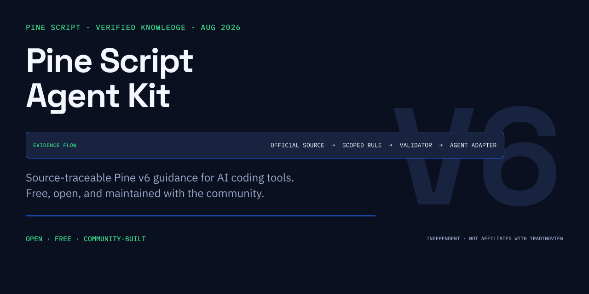
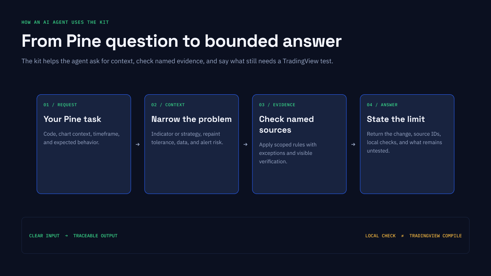
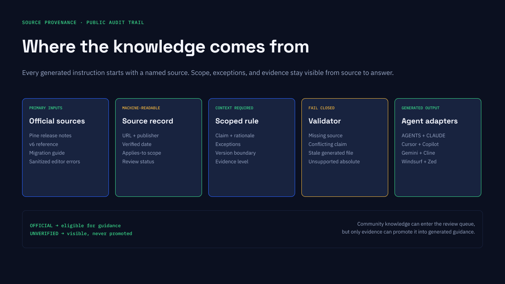

# Pine Script Agent Kit

Help AI coding tools give Pine Script v6 answers they can trace to named sources.

[Türkçe](README.tr.md)



[](https://github.com/trugurpala/pinescriptv6/actions/workflows/quality.yml)
[](https://github.com/trugurpala/pinescriptv6/releases/latest)
[](LICENSE)
[](https://github.com/trugurpala/divan)

Pine Script Agent Kit gives Codex, Claude Code, Cursor, Copilot, Gemini, Cline, Windsurf, and Zed the same evidence-aware Pine v6 guidance. It keeps the source, the rule, its exceptions, and its verification state connected.

> [!NOTE]
> **Project status:** No failing automation currently requires intervention. The project is in maintenance and accepts community contributions.
>
> The current release is **v1.0.0**. It is the clean public starting point for future changes.

> [!IMPORTANT]
> This kit can improve an AI answer, but it cannot replace the TradingView compiler or a chart test. A repository check never becomes a claim that Pine code compiles, never repaints, is secure, or is profitable.

[Start](#start-with-your-pine-task) · [How it works](#how-an-ai-agent-uses-this-kit) · [Sources](#where-the-knowledge-comes-from) · [Verification](#what-the-evidence-levels-mean) · [Community](#free-for-the-community) · [Contribute](#contributing)

## Start with your Pine task

Choose the path that matches what you need:

- **Write or fix Pine code:** open this repository in a supported AI coding tool, then describe the indicator, strategy, library, migration, or error
- **Review existing code:** include the chart timeframe, requested timeframes, repaint expectations, strategy behavior, and alert or webhook use
- **Check this knowledge pack:** clone the repository and run the local validation commands below

You do not need an API key or an installed package to run the repository checks.

## What it does for you

- Gives the AI named Pine v6 sources instead of an anonymous collection of tips
- Keeps each rule within its intended scope and preserves known exceptions
- Stops unsupported or conflicting rules before they reach generated agent instructions
- Shows whether a result came from an official source, a recorded TradingView check, or a local repository check
- Keeps instructions consistent across supported AI coding tools

## What it does not do

- It does not include or imitate the TradingView Pine compiler
- It does not prove that every example compiles or behaves correctly on every chart
- It does not promise profit, security, or non-repainting behavior
- It does not check account plans, data access, symbols, exchanges, or available history
- It does not send usage data or ask for secrets during local validation
- It does not authorize live trading or place real credentials in webhook examples

## How an AI agent uses this kit

Ask for the outcome you need. Include the chart context when it changes the answer.

```text
Review this Pine v6 indicator for repaint risk. Keep its current behavior.
The chart is 15 minutes and it requests 1-hour data. Cite the source IDs you use.
Tell me what you checked locally and what still needs a TradingView test.
```

### What the answer should tell you

A useful answer should:

1. State the relevant assumptions before changing the code
2. Apply only rules that match those assumptions
3. Name the source IDs behind Pine-specific behavior
4. Preserve exceptions instead of turning guidance into an “always” rule
5. Separate a local repository result from a TradingView compile or chart result



## Quick start

You need Git and Python 3.11 or newer. The local tools use the Python standard library.

```bash
git clone https://github.com/trugurpala/pinescriptv6.git
cd pinescriptv6
python tools/psak.py validate
python tools/psak.py render --check
python tools/psak.py check
```

Expected result:

```text
OK: repository data is valid
OK: generated outputs are current
OK: all offline checks passed
```

`python tools/psak.py links` is the only network-aware quality command. It checks registered official URLs and reports a link it cannot reach as unverified.

## Where the knowledge comes from

Every generated instruction starts with a named source. A source does not become agent guidance until the project records its scope, exceptions, and evidence level.



| Step | Repository source | What it records |
| --- | --- | --- |
| 1. Named sources | `knowledge/sources.json` | URL, publisher, location, access date, and applicability |
| 2. Scoped rules | `knowledge/catalog.json` | Claim, reason, scope, exceptions, source IDs, and evidence |
| 3. Human context | `knowledge/rules/` | Focused explanations for reviewers and contributors |
| 4. Validation | `tools/psak.py` | Missing sources, conflicts, invalid records, and generated drift |
| 5. Agent guidance | `agents/protocol.md` and `adapters/` | A shared behavior contract and tool-specific framing |
| 6. Example status | `examples/manifest.json` | SHA-256 and verification state for every tracked `.pine` file |
| 7. Manual evidence | `verification/tradingview.json` | Hash-bound TradingView test records |

Read the full model in [Source provenance](docs/provenance.md).

## What the evidence levels mean

| Level | Plain meaning | What the project may say |
| --- | --- | --- |
| `official` | Current TradingView documentation supports the rule | Use it only within the recorded scope |
| `tradingview-verified` | A person recorded a dated Pine Editor check for this exact file hash | Report only that file and environment as checked |
| `structural-only` | Local repository checks passed | Report the checks, but do not call the code compiled |
| `unverified` | The evidence is incomplete | Keep it out of generated guidance |

Changing a Pine file changes its SHA-256 hash and invalidates an older manual record. A temporary source-link failure creates a review signal; it does not silently delete the last known rule.

## Current Pine v6 coverage

The source catalog follows official Pine v6 release notes through July 2026. Coverage includes conditionally active inputs, current-contract and ISIN fields, `timeframe_bars_back`, `request.footprint()`, multiline strings, user-defined type sorting, updated wrapping, and historical tick recalculation.

Coverage does not guarantee that every account, market, timeframe, or chart supports every feature. Read [Pine v6 release coverage](knowledge/releases/2025-2026.md) for version boundaries.

Official starting points:

- [Pine Script release notes](https://www.tradingview.com/pine-script-docs/release-notes/)
- [Pine v6 migration guide](https://www.tradingview.com/pine-script-docs/migration-guides/to-pine-version-6/)
- [Pine Script v6 reference](https://www.tradingview.com/pine-script-reference/v6/)
- [Strategies](https://www.tradingview.com/pine-script-docs/concepts/strategies/)
- [Bar states](https://www.tradingview.com/pine-script-docs/concepts/bar-states/)
- [Inputs](https://www.tradingview.com/pine-script-docs/concepts/inputs/)

## Examples and verification

The repository tracks 56 Pine v6 files. `examples/manifest.json` records them as `structural-only`: each file exists, is non-empty, has a SHA-256 entry, and declares `//@version=6` on its first line.

That status does not establish compilation, runtime behavior, profitability, non-repainting behavior, data access, or live-trading suitability. Check `examples/manifest.json` and any matching `verification/tradingview.json` record before making a stronger claim.

To promote an example beyond `structural-only`, follow [TradingView manual verification](docs/tradingview-manual-verification.md).

## Supported AI tools

| Tool | Project surface |
| --- | --- |
| Portable Agent Skill | [`SKILL.md`](SKILL.md) |
| Codex | `AGENTS.md` |
| Claude Code | `CLAUDE.md` |
| Gemini CLI | `GEMINI.md` |
| Cursor | `.cursor/rules/pinescriptv6.mdc` |
| Cline | `.clinerules` |
| Windsurf | `.windsurf/rules/pine-script-agent-kit.md` |
| GitHub Copilot | `.github/copilot-instructions.md` and scoped instructions |
| Zed | `AGENTS.md` and the `.zed/rules` compatibility bridge |
| Portable knowledge pack | `generated/custom-gpt/` |

## Quality commands

```bash
python -m unittest discover -s tests -v
python tools/psak.py validate
python tools/psak.py render --check
python tools/psak.py check
python tools/psak.py links
```

`check` runs offline and combines catalog, example, critical-file, and generated-drift checks. Link checking stays separate because network availability does not prove repository correctness. GitHub runs the same offline gates in `.github/workflows/quality.yml`.

The advisory `source-links` workflow can be run manually or on its weekly schedule to check official source URLs without making network availability a required PR gate.

## Security and privacy

Do not place webhook secrets, exchange credentials, private Pine code, customer data, or personal information in examples, issues, or pull requests. Webhook examples use placeholders. Live use still needs authentication, payload validation, replay protection, rate limits, and trading-risk controls.

Report sensitive issues privately through [SECURITY.md](SECURITY.md).

## Free for the community

This project is free and open community infrastructure. It has no paid API, usage quota, runtime telemetry, or proprietary build service. Local validation works with Python's standard library.

You can contribute without writing code. Report an official-source change, improve an explanation, add a sourced rule, record a manual check, or test an adapter in another AI coding tool.

Use [GitHub Discussions](https://github.com/trugurpala/pinescriptv6/discussions) for questions and proposals. Use the [issue chooser](https://github.com/trugurpala/pinescriptv6/issues/new/choose) for reproducible defects, source changes, and documentation problems. See [Support](SUPPORT.md) for the full routing guide.

## Contributing

A knowledge contribution needs a source ID, a scoped claim, an evidence level, a verification date, tests, and current generated outputs. Start with [CONTRIBUTING.md](CONTRIBUTING.md) and follow the [Code of Conduct](CODE_OF_CONDUCT.md).

## Project documentation

- [How source and evidence are tracked](docs/provenance.md)
- [TradingView manual verification](docs/tradingview-manual-verification.md)
- [Public writing principles](docs/writing-style.md)
- [Pine v6 release coverage](knowledge/releases/2025-2026.md)
- [Portable Agent Skill](SKILL.md)
- [Contribution guide](CONTRIBUTING.md), [security policy](SECURITY.md), and [Code of Conduct](CODE_OF_CONDUCT.md)
- [Support guide](SUPPORT.md)
- [Change history](CHANGELOG.md) and [citation metadata](CITATION.cff)

## Releases, license, and citation

The current release is **v1.0.0**. See the [release record](https://github.com/trugurpala/pinescriptv6/releases/tag/v1.0.0) and [changelog](CHANGELOG.md). Future changes stay under `Unreleased` until they receive their own tag and GitHub Release.

Code and project documentation use the [MIT License](LICENSE). Citation metadata is available in [CITATION.cff](CITATION.cff).

## Built with Divan

[Divan](https://github.com/trugurpala/divan) helped research, plan, implement, inspect, and prepare this project. It is open source and is not a runtime dependency.

The public visual system is **Verified Signal**. The editable source lives in [Figma](https://www.figma.com/design/o0rNk4Cur1kh9JGyQymxoE), and its principles live in [the visual philosophy](docs/design/verified-signal-philosophy.md).

Maintained by [Uğur Pala](https://github.com/trugurpala) for the community.

This independent project is not affiliated with or endorsed by TradingView. Pine Script and TradingView are trademarks of their respective owners.
