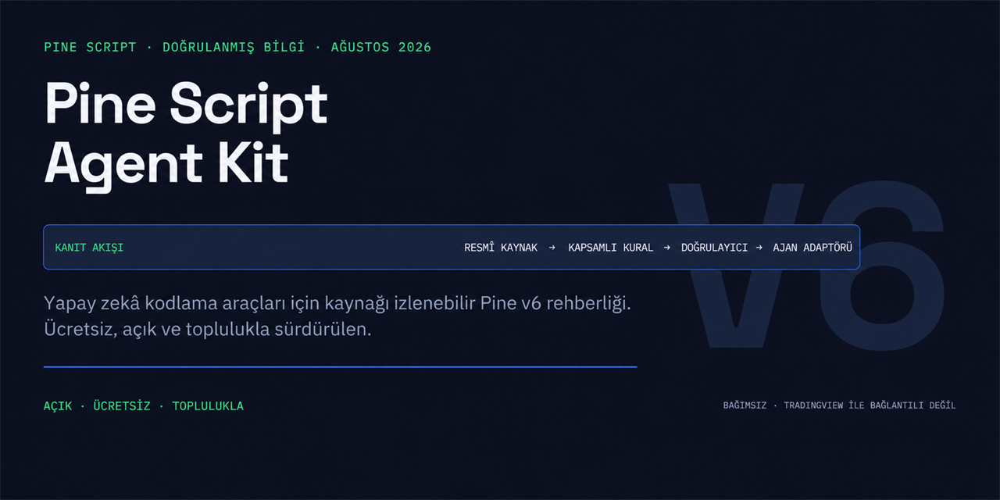

# Pine Script Agent Kit

Yapay zekâ kodlama araçlarının Pine Script v6 yanıtlarını adı belli kaynaklara dayandırmasına yardım eder.

[English](README.md)



[](https://github.com/trugurpala/pinescriptv6/actions/workflows/quality.yml)
[](https://github.com/trugurpala/pinescriptv6/releases/latest)
[](LICENSE)
[](https://github.com/trugurpala/divan)

Codex, Claude Code, Cursor, Copilot, Gemini, Cline, Windsurf, Zed ve Devin ile
çalışır.

## En sade anlatımıyla

İhtiyacın olan Pine göstergesini, stratejiyi, v6 taşımasını, hatayı veya kod
incelemesini anlatırsın. Bu paket, desteklenen yapay zekâ aracına kaynak bağlantılı
Pine v6 kurallarını, istisnalarını ve dürüst doğrulama sınırlarını verir. Araç da
hangi bilgiye dayandığını ve TradingView'de neyin hâlâ denenmesi gerektiğini
açıklayan kod veya inceleme üretebilir.

```text
Pine görevin ve grafik bağlamın
        ↓
Resmî kaynaklar + kapsamı belirli kurallar + kayıtlı kanıt
        ↓
AI kodu veya incelemesi + kaynak kimlikleri + kalan elle kontroller
```

Depo şunları sunar:

- kurulabilir Codex becerisi ve taşınabilir ajan talimatları;
- Codex, Claude Code, Cursor, Copilot, Gemini, Cline, Windsurf, Zed ve Devin için
  üretilmiş adaptörler;
- doğrulama durumu dosya özetine bağlı 56 Pine v6 örneği;
- katalog bütünlüğünü, örnek envanterini ve üretilmiş dosya farklarını denetleyen
  Python standart kütüphane kontrolleri.

Pine kodunda yapay zekâ desteği isterken bilginin kaynağını gizlememek ve yerel
kontrolü TradingView sonucu gibi sunmamak istiyorsan bu paket işine yarar.

> [!NOTE]
> **Proje durumu:** Proje bakımdadır ve topluluk katkılarını kabul eder.
>
> Güncel sürüm **v1.2.0**’dır. Codex becerisini, daha açık topluluk yollarını ve kamusal proje yönetişimini paketler.

> **Önemli sınır**
> Bu paket bir yapay zekâ yanıtını iyileştirebilir. TradingView derleyicisinin veya grafik testinin yerini alamaz. Depo kontrolü, Pine kodunun derlendiğini, hiç yeniden çizim yapmadığını, güvenli ya da kârlı olduğunu kanıtlamaz.

[Başlangıç](#pine-görevinle-başla) · [Nasıl çalışır?](#bir-yapay-zekâ-ajanı-bu-paketi-nasıl-kullanır) · [Kaynaklar](#bilgi-nereden-geliyor) · [Doğrulama](#kanıt-seviyeleri-ne-anlama-geliyor) · [Divan](#divan-ile-geliştirildi) · [Topluluk](#topluluk-için-ücretsiz) · [Katkı](#projeye-katkı)

## Pine görevinle başla

İhtiyacına uyan yolu seç:

- **Pine kodu yaz veya düzelt:** depoyu desteklenen bir yapay zekâ aracında aç; göstergeyi, stratejiyi, kütüphaneyi, taşıma işini veya hatayı anlat
- **Elindeki kodu incelet:** grafik zamanını, istenen zamanları, yeniden çizim beklentini, strateji davranışını ve alarm kullanımını belirt
- **Bilgi paketini denetle:** depoyu indir ve aşağıdaki yerel doğrulama komutlarını çalıştır

Depo kontrolleri için API anahtarı veya ayrıca kurulacak bir paket gerekmez.

## Ne işe yarar?

- Yapay zekâya kaynağı belirsiz ipuçları yerine adı belli Pine v6 kaynakları verir
- Her kuralı geçerli olduğu kapsamda tutar ve bilinen istisnaları korur
- Desteklenmeyen veya çelişen kuralları ajan talimatlarına ulaşmadan durdurur
- Sonucun resmî kaynağa, kayıtlı TradingView kontrolüne veya yerel depo kontrolüne dayanıp dayanmadığını gösterir
- Desteklenen yapay zekâ araçlarına aynı temel davranışı verir

## Ne yapmaz?

- TradingView Pine derleyicisini içermez veya taklit etmez
- Her örneğin her grafikte derlendiğini ya da doğru çalıştığını kanıtlamaz
- Kâr, güvenlik veya hiç yeniden çizim yapmama sözü vermez
- Hesap paketini, veri erişimini, sembolü, borsayı veya geçmiş veri miktarını denetlemez
- Yerel doğrulama sırasında kullanım verisi göndermez veya gizli bilgi istemez
- Canlı işleme izin vermez; alarm örneklerine gerçek kimlik bilgisi koymaz

## Bir yapay zekâ ajanı bu paketi nasıl kullanır?

İstediğin sonucu açıkça yaz. Yanıtı değiştirecek grafik ayrıntılarını da ekle.

```text
Bu Pine v6 göstergesini yeniden çizim riski açısından incele. Mevcut davranışı koru.
Grafik 15 dakikalık, kod 1 saatlik veri istiyor. Kullandığın kaynak kimliklerini yaz.
Yerelde neyi kontrol ettiğini ve TradingView'de neyin denenmesi gerektiğini ayır.
```

### Yanıt sana ne söylemeli?

İyi bir yanıt şu sırayı izlemelidir:

1. Kodu değiştirmeden önce önemli varsayımları açıklar
2. Yalnız bu varsayımlara uyan kuralları kullanır
3. Pine davranışını dayandırdığı kaynak kimliklerini belirtir
4. İstisnaları korur; dar bir kuralı “her zaman” kuralına dönüştürmez
5. Yerel depo sonucunu TradingView derleme veya grafik sonucundan ayırır


## Hızlı başlangıç

Git ile Python 3.11 veya daha yeni bir sürüm gerekir. Yerel araçlar Python standart kütüphanesini kullanır.

```bash
git clone https://github.com/trugurpala/pinescriptv6.git
cd pinescriptv6
python tools/psak.py validate
python tools/psak.py render --check
python tools/psak.py check
```

Son `python tools/psak.py check` komutunun çıktısı şu satırlarla biter:

```text
OK: all offline checks passed
NOT CHECKED: TradingView compilation
NOT CHECKED: Runtime/chart behavior
NOT CHECKED: Repaint behavior
NOT CHECKED: Alert delivery
NOT CHECKED: Market data
NOT CHECKED: Profitability
```

Ağ kullanan tek kalite komutu `python tools/psak.py links` komutudur. Kayıtlı resmî adresleri denetler; ulaşamadığı bağlantıyı doğrulanmamış olarak bildirir.

## Codex Desktop'a kurulum

Pine Script rehberini projeler arasında tekrar kullanmak için paketlenmiş Codex
becerisini kur:

```text
$skill-installer https://github.com/trugurpala/pinescriptv6/tree/main/.agents/skills/pine-script-agent-kit
```

Kurulumdan sonra Codex'te görünmüyorsa Codex'i yeniden başlat. Ardından
`$pine-script-agent-kit` ile çağır ve [ADOPTION.md](ADOPTION.md) belgesindeki
kısa deneme istemini kullan. Yüklenebilir giriş noktası
`.agents/skills/pine-script-agent-kit/SKILL.md` dosyasıdır. Bir becerinin
kurulmuş olması, hostun bu beceriyi yüklediğini veya kurallara uyduğunu
kanıtlamaz; rehbere güvenmeden önce yüklü beceriyi doğrula.

## Bilgi nereden geliyor?

Üretilen her talimat, adı belli bir kaynakla başlar. Proje; kapsamı, istisnaları ve kanıt seviyesi kaydedilmeden bir bilgiyi ajan rehberliğine dönüştürmez.


| Adım | Depodaki kaynak | Ne kaydeder? |
| --- | --- | --- |
| 1. Adı belli kaynaklar | `knowledge/sources.json` | Adres, yayımlayan kurum, bölüm, erişim tarihi ve kullanım alanı |
| 2. Kapsamı belirli kurallar | `knowledge/catalog.json` | İddia, gerekçe, kapsam, istisnalar, kaynak kimlikleri ve kanıt |
| 3. İnsan açıklaması | `knowledge/rules/` | İnceleyenler ve katkı verenler için odaklı açıklamalar |
| 4. Doğrulama | `tools/psak.py` | Eksik kaynak, çelişki, geçersiz kayıt ve eski üretilmiş dosya |
| 5. Ajan rehberliği | `agents/protocol.md` ve `adapters/` | Ortak davranış sözleşmesi ve araca özel çerçeve |
| 6. Örnek durumu | `examples/manifest.json` | İzlenen her `.pine` dosyası için SHA-256 ve doğrulama durumu |
| 7. Elle yapılan kontrol | `verification/tradingview.json` | Dosya özetiyle eşleşen TradingView test kayıtları |

Ayrıntılı açıklama için [kaynak ve kanıt modelini](docs/provenance.md) okuyabilirsin.

## Kanıt seviyeleri ne anlama geliyor?

| Seviye | Açık anlamı | Proje ne söyleyebilir? |
| --- | --- | --- |
| `official` | Kuralı güncel TradingView belgesi destekler | Yalnız kayıtlı kapsam içinde kullanır |
| `tradingview-verified` | Bir kişi bu dosya özetini Pine Editor’da tarihli olarak denemiştir | Yalnız kayıtlı dosya ve ortam için denendi der |
| `structural-only` | Yerel depo kontrolleri geçmiştir | Kontrolleri söyler, fakat kodu derlenmiş saymaz |
| `unverified` | Kanıt eksiktir | Bilgiyi üretilen rehberliğe katmaz |

Pine dosyası değişince SHA-256 özeti de değişir; eski elle kontrol kaydı geçersiz olur. Kaynak bağlantısına geçici olarak ulaşılamaması son bilinen kuralı sessizce silmez, inceleme işareti oluşturur.

## Güncel Pine v6 kapsamı

Kaynak kataloğu, Temmuz 2026’ya kadar yayımlanan resmî Pine v6 sürüm notlarını izler. Koşula bağlı girdiler, güncel sözleşme ve ISIN alanları, `timeframe_bars_back`, `request.footprint()`, çok satırlı metinler, kullanıcı tanımlı tür sıralaması, güncel satır kaydırma, alarmlar, strateji hesaplaması, simüle emir gerçekleşme zamanlaması ve yeniden çizim sınıflandırması kapsamdadır.

Bu kapsam, her hesabın, piyasanın, zaman diliminin veya grafiğin bütün özellikleri desteklediğini göstermez. [Güncel ve planlanan kapsamı](COVERAGE.md) inceleyebilir, sürüm sınırları için [Pine v6 sürüm kapsamını](knowledge/releases/2025-2026.md) okuyabilirsin.

Başlıca resmî kaynaklar:

- [Pine Script sürüm notları](https://www.tradingview.com/pine-script-docs/release-notes/)
- [Pine v6 taşıma rehberi](https://www.tradingview.com/pine-script-docs/migration-guides/to-pine-version-6/)
- [Pine Script v6 başvuru kaynağı](https://www.tradingview.com/pine-script-reference/v6/)
- [Stratejiler](https://www.tradingview.com/pine-script-docs/concepts/strategies/)
- [Çubuk durumları](https://www.tradingview.com/pine-script-docs/concepts/bar-states/)
- [Girdiler](https://www.tradingview.com/pine-script-docs/concepts/inputs/)

## Örnekler ve doğrulama

Depo, Git tarafından izlenen 56 Pine v6 dosyası içerir. `examples/manifest.json` dosyaların 55'ini `structural-only`, birini ise tarihli ve dosya özetine bağlı Pine Editor kontrolü için `tradingview-verified` olarak kaydeder. Her dosya vardır, boş değildir, SHA-256 envanterinde yer alır ve ilk satırında `//@version=6` bulunur.

Elle kayıt, yalnızca belirtilen tam dosya özeti ve ortam için yazılan Pine Editor kontrolünü gösterir. Hiçbir durum; çalışma davranışını, kârlılığı, yeniden çizim yapmamayı, veri erişimini, güvenliği, uyarı teslimini veya canlı işlem uygunluğunu kanıtlamaz. Daha güçlü bir cümle kurmadan önce `examples/manifest.json` ile varsa eşleşen `verification/tradingview.json` kaydını denetle.

Bir örneği `structural-only` durumunun ötesine taşımak için [TradingView elle doğrulama rehberini](docs/tradingview-manual-verification.md) izle.

## Desteklenen yapay zekâ araçları

Dosyaları yerleştirmek, yerel kontrolleri çalıştırmak ve aracın rehberi kullanıp
kullanmadığını sınamak için [kullanım rehberini](ADOPTION.md) izle.

| Araç | Projedeki talimat yüzeyi |
| --- | --- |
| Taşınabilir ajan becerisi | [`SKILL.md`](SKILL.md) |
| Codex Desktop becerisi | [`.agents/skills/pine-script-agent-kit/SKILL.md`](.agents/skills/pine-script-agent-kit/SKILL.md) |
| Codex | `AGENTS.md` |
| Claude Code | `CLAUDE.md` |
| Gemini CLI | `GEMINI.md` |
| Cursor | `.cursor/rules/pinescriptv6.mdc` |
| Cline | `AGENTS.md` |
| Devin | `AGENTS.md` |
| Windsurf | `AGENTS.md` (birincil) |
| GitHub Copilot | `.github/copilot-instructions.md` ve kapsama özel talimatlar |
| Zed | `.cursorrules` |
| Taşınabilir bilgi paketi | `generated/custom-gpt/` |

## Kalite komutları

```bash
python -m unittest discover -s tests -v
python tools/psak.py validate
python tools/psak.py render --check
python tools/psak.py check
python tools/psak.py links
```

`check`; katalog, örnek, kritik dosya ve üretilmiş dosya farklarını ağ kullanmadan denetler. Ağ erişimi depo doğruluğunu kanıtlamadığı için bağlantı denetimi ayrıdır. GitHub, aynı çevrim dışı kontrolleri `.github/workflows/quality.yml` ile çalıştırır.

Danışma amaçlı `source-links` workflow'u elle veya haftalık zamanlamayla resmî kaynak adreslerini denetler; ağ erişimini zorunlu PR kapısına dönüştürmez.

## Güvenlik ve gizlilik

Alarm gizli anahtarını, borsa kimlik bilgilerini, özel Pine kodunu, müşteri verisini veya kişisel bilgiyi örneklere, issue kayıtlarına ya da pull request’lere koyma. Alarm örnekleri yer tutucu kullanır. Canlı kullanım ayrıca kimlik doğrulama, veri doğrulama, tekrar gönderim koruması, hız sınırı ve işlem riski denetimi ister.

Hassas sorunları [SECURITY.md](SECURITY.md) üzerinden özel olarak bildir.

## Divan ile geliştirildi

Bu proje [Divan](https://github.com/trugurpala/divan) ile planlanıp teslim
edilmiştir. Divan; Codex ve Claude Code gibi kodlama hostlarına plan, kalıcı
bağlam ve doğrulanabilir teslim katmanı ekler. Bir yapay zekâ modeli veya ayrı
bir bulut hizmeti değildir. Pine Script Agent Kit'i kurmak, kullanmak,
doğrulamak ya da projeye katkı vermek için Divan kullanmanız gerekmez.

## Topluluk için ücretsiz

Bu proje ücretsiz ve açık bir topluluk altyapısıdır. Ücretli API, kullanım kotası, çalışma sırasında kullanım verisi gönderimi veya kapalı üretim hizmeti içermez. Yerel doğrulama Python standart kütüphanesiyle çalışır.

Katkı vermek için kod yazman gerekmez. Resmî kaynak değişikliğini bildirebilir, bir açıklamayı sadeleştirebilir, kanıtlı kural ekleyebilir, elle kontrol kaydı oluşturabilir veya başka bir yapay zekâ aracındaki talimatları deneyebilirsin.

Soru ve öneriler için [GitHub Discussions](https://github.com/trugurpala/pinescriptv6/discussions) bölümünü kullan. Tekrarlanabilir hata, kaynak değişikliği veya belge sorunu için uygun [issue formunu](https://github.com/trugurpala/pinescriptv6/issues/new/choose) seç. Ayrıntılı yönlendirme için [destek rehberine](SUPPORT.md) bak.

## Projeye katkı

Bilgi katkısı; kaynak kimliği, kapsamı belirli iddia, kanıt seviyesi, doğrulama tarihi, testler ve güncel üretilmiş dosyalar içermelidir. [CONTRIBUTING.md](CONTRIBUTING.md) ile başla, [Davranış Kuralları](CODE_OF_CONDUCT.md) belgesine uy ve kararlarla bakım sorumlulukları için [yönetişim belgesine](GOVERNANCE.md) bak.

## Proje belgeleri

- [Kullanım rehberi](ADOPTION.md), [kapsam](COVERAGE.md) ve [yol haritası](ROADMAP.md)
- [Alarm rehberi](docs/alerts.md) ve [strateji yürütme rehberi](docs/strategy-execution.md)
- [Yeniden çizim sınıflandırması](docs/repainting-taxonomy.md) ve [strateji simülasyonunun gerçekçiliği](docs/backtesting-realism.md)
- [Kaynak ve kanıt nasıl izleniyor?](docs/provenance.md)
- [TradingView elle doğrulama rehberi](docs/tradingview-manual-verification.md)
- [Kamusal yazım ilkeleri](docs/writing-style.md)
- [Pine v6 sürüm kapsamı](knowledge/releases/2025-2026.md)
- [Taşınabilir ajan becerisi](SKILL.md)
- [Katkı rehberi](CONTRIBUTING.md), [yönetişim](GOVERNANCE.md), [güvenlik politikası](SECURITY.md) ve [Davranış Kuralları](CODE_OF_CONDUCT.md)
- [Destek rehberi](SUPPORT.md)
- [Değişiklik geçmişi](CHANGELOG.md) ve [atıf bilgileri](CITATION.cff)

## Sürüm, lisans ve atıf

Güncel sürüm **v1.2.0**’dır. [Sürüm kaydını](https://github.com/trugurpala/pinescriptv6/releases/tag/v1.2.0) ve [değişiklik günlüğünü](CHANGELOG.md) inceleyebilirsin. Sonraki çalışmalar, kendi etiketi ve GitHub Release kaydı oluşana kadar `Unreleased` altında kalır.

Kod ve proje belgeleri [MIT Lisansı](LICENSE) ile yayımlanır. Atıf bilgileri [CITATION.cff](CITATION.cff) içindedir.

Kamusal görsel sistemin adı **Verified Signal**’dır. Düzenlenebilir kaynak [Figma](https://www.figma.com/design/o0rNk4Cur1kh9JGyQymxoE), ilkeler ise [görsel felsefe belgesi](docs/design/verified-signal-philosophy.md) içindedir.

Topluluk için [Uğur Pala](https://github.com/trugurpala) tarafından sürdürülür.

Bu bağımsız proje TradingView ile bağlantılı değildir ve TradingView tarafından onaylanmamıştır. Pine Script ve TradingView markaları ilgili sahiplerine aittir.
